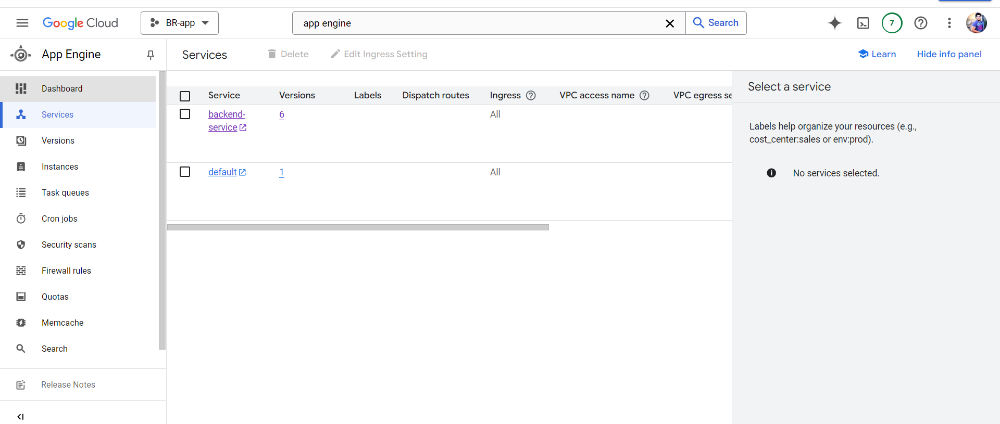
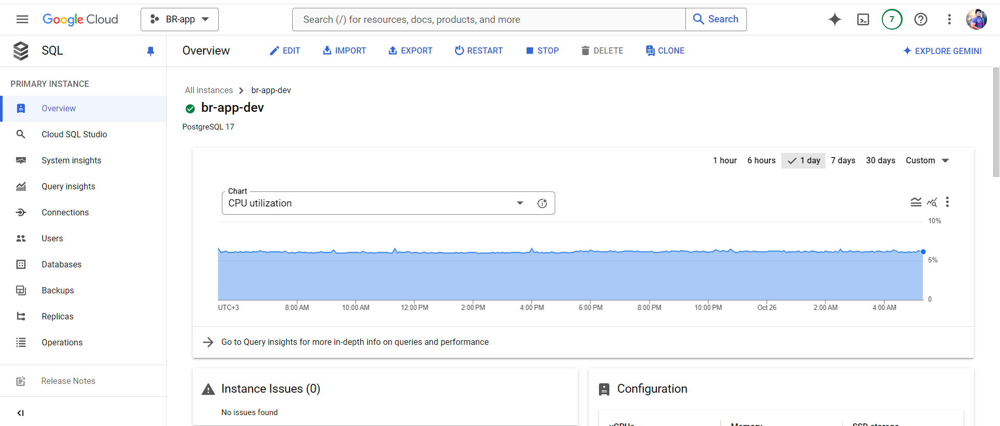
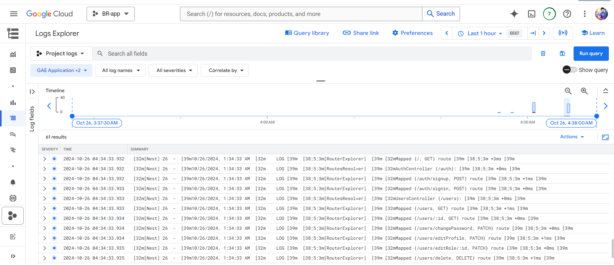
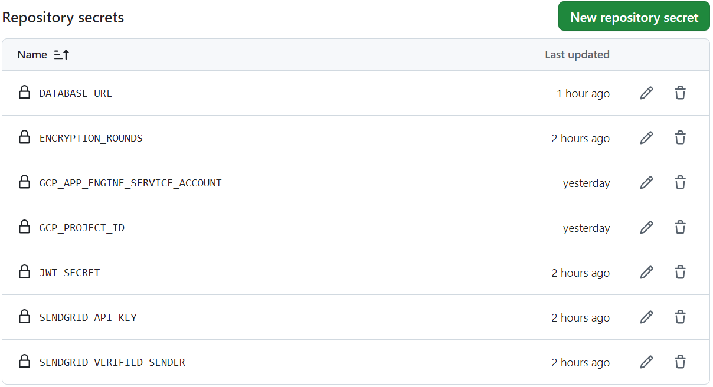

# Flutter & NestJS App with Google Cloud Deployment

This project is a simple web/mobile application using a **Flutter frontend** and a **NestJS backend**. The backend is deployed to **Google App Engine** with an automated CI/CD pipeline, and the **PostgreSQL** database is hosted on **Google Cloud SQL**.

---

## Table of Contents

- [Project Overview](#project-overview)
- [Technologies Used](#technologies-used)
- [Architecture](#architecture)
- [Setup Instructions](#setup-instructions)
  - [Frontend (Flutter)](#frontend-flutter)
  - [Backend (NestJS)](#backend-nestjs)
- [CI/CD Pipeline](#cicd-pipeline)
- [Database Configuration](#database-configuration)
- [Environment Variables](#environment-variables)
- [Deployment to Google Cloud](#deployment-to-google-cloud)
- [Functionalities Overview](#functionalities-overview)
- [API Endpoints](#api-endpoints)
- [Workflow](#workflow)
- [License](#license)

---

## Project Overview

This application includes a **Flutter frontend** and a **NestJS backend**:
- **Frontend**: Built using **Flutter**, it provides a simple UI and interacts with the backend API.
- **Backend**: Built using **NestJS**, it includes the core business logic, and API routes, and connects to a PostgreSQL database.
- **Database**: A **PostgreSQL** database hosted on **Google Cloud SQL** stores application data.
- **Deployment**: The backend is automatically deployed to **Google App Engine** through a CI/CD pipeline (needs more debugging and fixing configurations) .

---

## Technologies Used

- **Frontend**: Flutter
- **Backend**: NestJS
- **Database**: PostgreSQL on Google Cloud SQL
- **CI/CD Pipeline**: GitHub Actions
- **Deployment**: Google App Engine

---

## Architecture

- **Flutter Frontend**: Interacts with the NestJS backend through HTTP requests.
- **NestJS Backend**: Exposes RESTful API endpoints and connects to a PostgreSQL database.
- **Database**: PostgreSQL instance on Google Cloud SQL, accessed by the NestJS application via a secure Unix socket connection.

---

## Setup Instructions

### Frontend (Flutter)

1. **Install Flutter**: Make sure you have Flutter installed. Follow [Flutter installation guide](https://flutter.dev/docs/get-started/install).
2. **Run the Flutter app**:
   ```bash
   cd frontend
   flutter pub get
   flutter run
   ```
3. **Configure API URL**:
   - Update the API URL in your Flutter code to point to the backend URL on Google App Engine.
   - There are 2 options for api's, the first is for testing and the other is for production.

### Backend (NestJS)

1. **Install Node.js and NestJS CLI**:
   - Make sure you have **Node.js** installed.
   - Install the NestJS CLI globally:
     ```bash
     npm install -g @nestjs/cli
     ```

2. **Set Up Environment Variables**:
   - Create a `.env` file in the backend root directory.
   - .env variables exist in the github repo as secrets.


3. **Run the NestJS Application Locally**:
   ```bash
   cd backend
   npm install
   npm run start:dev
   ```

4. **Test the API**:
   - Once running, the NestJS backend API should be accessible at `http://localhost:3000`.

---

## CI/CD Pipeline

A **GitHub Actions** workflow is configured to automate the deployment of the backend to Google App Engine:
- **Trigger**: The pipeline triggers on every push to the `main` branch.
- **Process**: The pipeline checks out the code, installs dependencies, builds the project, and deploys it to Google App Engine.
- **Secrets**: Ensure that the following GitHub repository secrets are set:
  - `GCP_APP_ENGINE_SERVICE_ACCOUNT`: Google Cloud service account JSON for authentication.
  - `GCP_PROJECT_ID`: Google Cloud project ID.

---

## Database Configuration

The **PostgreSQL** database is hosted on **Google Cloud SQL** and connected to the NestJS backend via Prisma ( including the needed migrations):
1. **Create a PostgreSQL instance on GCP**.
2. **Set up a Cloud SQL connection**:
   - Use the `INSTANCE_CONNECTION_NAME` in the connection string, typically in the format:
     ```
     YOUR_PROJECT_ID:YOUR_REGION:YOUR_INSTANCE_NAME
     ```
3. **Grant App Engine Access**:
   - In the Google Cloud Console, grant the **Cloud SQL Client** role to the App Engine deployment service account created.
   
4. **Connection String**:
   - There are 2 forms of connection strings, 1 for the local testing and 1 for the deployed application since the database and the app engine are in the same project on GCP.
    
---

## Environment Variables

| Variable                | Description                                  |
|-------------------------|----------------------------------------------|
| `DATABASE_URL`          | Connection string for PostgreSQL database.   |
| `SENDGRID_API_KEY`      | API key used for the SENDGRID service.          |
| `SENDGRID_VERIFIED_SENDER`        | The email account that sends the mail.                     |
| `ENCRYPTION_ROUNDS`        | The rounds used for password encryption.                     |
| `JWT_SECRET`        | JWT secret for generating the JWT token.                     |
| `GCP_PROJECT_ID`        | Google Cloud project ID.                     |
| `GCP_APP_ENGINE_SERVICE_ACCOUNT` | Service account JSON for GCP authentication.|
    ``
---

## Deployment to Google Cloud

1. **App Engine Deployment**: The backend deploys to Google App Engine, which automatically scales based on traffic.
2. **Running the Pipeline**:
   - Push changes to the `master` branch to trigger the deployment pipeline.
   - The pipeline deploys the latest code to Google App Engine.

---


## Functionalities Overview

### 1. User Role
- **Sign Up**: 
  - When a user signs up, they are assigned a randomly generated password that is sent to them via email, which they should change after signing in for the first time.
- **Sign In**:
  - Users can sign in with their email and generated password.
- **Edit Profile**:
  - Users can edit their own profile information, including details like their name, email, and other personal information.

### 2. Admin Role
- **Sign Up**:
  - Admins can sign up with the same flow as regular users, receiving a randomly generated password.
- **Sign In**:
  - Admins can sign in with their email and password.

- **Edit User Roles**:
  - Admins can modify the roles of other users. For instance, they can assign or revoke the "Admin" role or other custom roles as needed.

- **Delete Users**:
  - Admins can delete users accounts if needed.

### 2. Viewer Role
- **Sign Up**:
  - Viewers can sign up with the same flow as regular users, receiving a randomly generated password.
- **Sign In**:
  - Viewers can sign in with their email and password.
- **View all accounts**
  - Viewers can view all the accounts in the system but can't edit or interact with them.

---


## API Endpoints

### Authentication Endpoints
- **POST** `/auth/signup` - Sign up a new user with a randomly generated password.
- **POST** `/auth/signin` - Sign in to get an access token.

### Users Controller

This controller handles user-related operations including viewing, editing, and deleting user profiles.

- **GET** `/users` - Retrieve a list of all users.
- **GET** `/users/:id` - Retrieve a specific user's details by ID.
- **PATCH** `/users/changePassword` - Change the password of the authenticated user.
- **PATCH** `/users/editProfile` - Edit the authenticated user's profile information.
- **PATCH** `/users/editRole/:id` - Edit the role of a specific user (admin only).
- **DELETE** `/users/delete` - Delete the authenticated user.
- **DELETE** `/users/deleteUser/:id` - Delete a specific user by ID (admin only).


---

## Workflow

1. **User Registration**:
   - Upon registration, a random password is generated and assigned to the new user. This password can be shared via email or other secure means.
  
2. **User Sign In**:
   - Users sign in with their email and assigned password to receive an access token for authenticated routes.
   
3. **Edit Profile**:
   - Users can edit their own profile through the `/users/editProfile` endpoint.
   
4. **Admin Role Management**:
   - Admins have access to role management endpoints, allowing them to modify other users' roles as needed.

---

## Notes

- **Password Generation**: Passwords are randomly generated at sign-up and should be updated by users for better security.
- **Access Control**: Access to each endpoint is controlled by role-based permissions.
- **Role Management**: Only Admins have permissions to change roles of other users.
- Attached are some screenshots to show deployed database and progress of backend deployment.
- 
- 
- 
- 
- 
--- 

This setup allows for secure handling of user data, role management by Admins, and password-based authentication.


## License

This project is licensed under the MIT License. See the [LICENSE](LICENSE) file for details.
